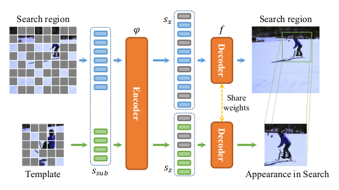

# MAT
[Representation Learning for Visual Object Tracking by Masked Appearance Transfer](./misc/CVPR_23_MAT_Final.pdf)


---



## **Installation**

- Clone the repository locally

- Create a conda environment

```commandline
conda env create -f env.yaml
conda activate mat
pip install --upgrade git+https://github.com/got-10k/toolkit.git@master
# (You can use `pipreqs ./root` to analyse the requirements of this project.)
```


## **Training**

- Prepare the training data:
  We use LMDB to store the training data. Please check `./data/parse_<DATA_NAME>` and generate lmdb datasets.
- Specify the paths in `./lib/register/paths.py`.

All of our models are trained on a single machine with two RTX3090 GPUs. For distributed training on a single node with 2 GPUs:

- MAT pre-training
```commandline
python -m torch.distributed.launch --nproc_per_node=2 train.py --experiment=translate_template --train_set=common_pretrain
```
- Tracker training

Modify the `cfg.model.backbone.weights` in `./config/cfg_translation_track.py` to be the last checkpoint of the MAT pre-training.
```commandline
python -m torch.distributed.launch --nproc_per_node=2 train.py --experiment=translate_track --train_set=common
```

<details>
<summary><i>Arguments:</i></summary>

- `-e` or `--experiment`:         the name of experiment -- check `./lib/register/experiments.py` to get more
  information about each experiment.
- `-t` or `--train_set`:          the name of train set -- check `./lib/register/dataset.py` to get more information
  about each train set.
- `--resume_epoch`:       resume from which epoch -- for example, `100` indicates we load `checkpoint_100.pth` and
  resume training.
- `--pretrain_name`:      the full name of the pre-trained model file -- for example, `checkpoint_100.pth` indicates we
  load `./pretrain/checkpoint_100.pth`.
- `--pretrain_lr_mult`:   pretrain_lr = pretrain_lr_mult * base_lr -- load pre-trained weights and fine tune these
  parameters with `pretrain_lr`.
- `--pretrain_exclude`:   the keyword of the name of pre-trained parameters that we want to discard -- for
  example, `head` indicates we do not load the pre-trained weights whose name contains `head`.
- `--gpu_id`:             CUDA_VISIBLE_DEVICES
- `--find_unused`:        used in DDP mode

</details>


## **Evaluation**

We provide a multi-process testing script for evaluation on several benchmarks.
Please modify the paths to your dataset in `./lib/register/paths.py`.
Download the [checkpoint](https://drive.google.com/file/d/1rQ_hWsd0ZlBax224V443M42aNGasfKdR/view?usp=share_link) and put it into `./checkpoints/translate_track_common/`.
```shell
python test.py --gpu_id=0,1 --num_process=0 --experiment=translate_track --train_set=common --benchmark=lasot --vis
```

<details>
<summary><i>Arguments:</i></summary>

- `-e` or `--experiment`:         the name of experiment -- check `./lib/register/experiments.py` to get more
  information about each experiment.
- `-t` or `--train_set`:          the name of train set -- check `./lib/register/dataset.py` to get more information
  about each train set.
- `-b` or `--benchmark`:          the name of benchmark -- check `./lib/register/benchmarks.py` to get more information
  about each benchmark.
- `--test_epoch`:         ckp of which epoch -- the default value is `300` indicates we load weights from the last epoch.
- `--num_process`:        max processes each time, set 0 for single-process test.
- `--gpu_id`:             CUDA_VISIBLE_DEVICES
- `--vis`:                show tracking result.

</details>


---

## Citation

```bibtex
@inproceedings{zhao2023mat,
  title={Representation Learning for Visual Object Tracking by Masked Appearance Transfer},
  author={Haojie Zhao and Dong Wang and Huchuan Lu},
  booktitle={Proceedings of the IEEE/CVF Conference on Computer Vision and Pattern Recognition},
  year={2023}
}
```

## **Acknowledgments**

- Thanks for the great [MAE](https://github.com/facebookresearch/mae),
[MixFormer](https://github.com/MCG-NJU/MixFormer),
[pysot](https://github.com/STVIR/pysot).
- For data augmentation, we use [Albumentations](https://github.com/albumentations-team/albumentations).


## **License**

This work is released under the **GPL 3.0 license**. Please see the
LICENSE file for more information.


